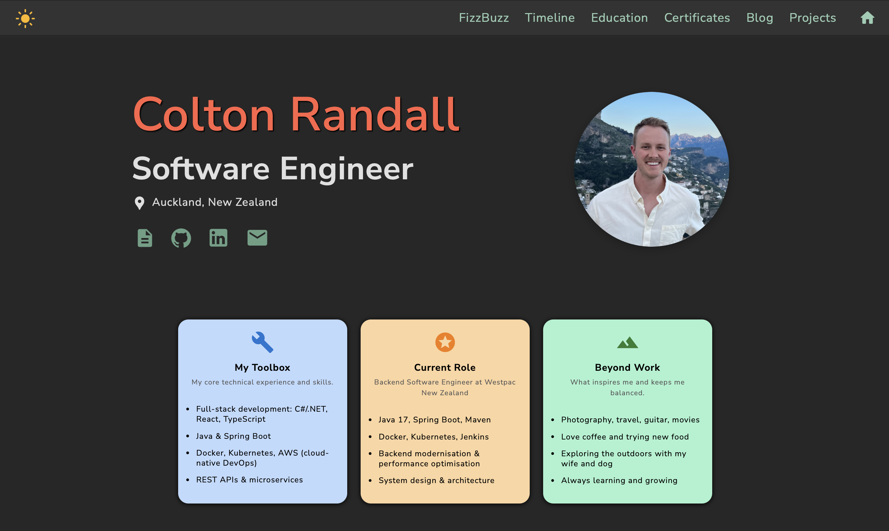
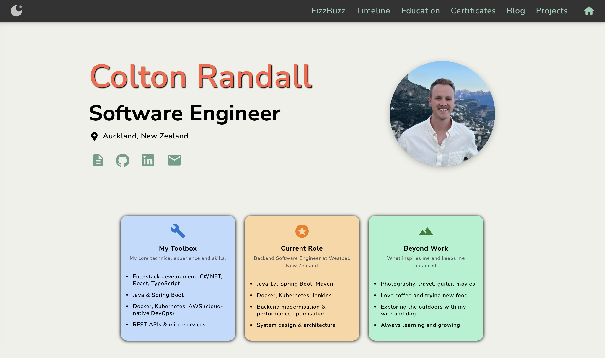

# Colton’s Developer Portfolio | Website

<br/>

🔗 View the live site → [coltonrandall.com](https://coltonrandall.com)

Welcome to my personal developer portfolio. This is a space where you can learn more about my professional background, training, and explore the projects I’ve built 🔨.

This site also serves as my development sandbox, where I consolidate modern web knowledge across frameworks and languages, while experimenting with new tools, techniques, and UI patterns.

<br/>

### UI

Dark mode



Light mode



Mobile
<br/>


<br/>

### ⚙️ Tech Stack

- Framework: React
- UI Library: Material UI (MUI)
- Deployment: GitHub Actions + GitHub Pages
- Infrastructure as Code: Terraform for AWS S3 static website hosting
- Responsive Design: Mobile & tablet-friendly layouts

This version is a complete overhaul of my original static HTML/CSS/JS site, which you can still view here: [old-portfolio-website](https://github.com/ColtonRandall/old-portfolio-website).

<br/>

### 🌐 AWS Integration

This project also includes a Terraform setup for deploying the site to AWS S3. The configuration automates the creation of an S3 bucket, enables static website hosting, and uploads the production-ready files from the `dist` directory. The intention is for this project to be fully moved to the cloud in the near future.

<br/>

### 🚀 Deployment Workflow

This project is currently deployed to **GitHub Pages** as the primary production site, with an experimental deployment to **AWS S3** using Terraform. Below is the workflow for updating the site:

1. **Make Code Changes**:

   - Edit the code in the `src/` directory.

2. **Test Locally**:

   - Run the development server:
     ```sh
     npm run dev
     ```

3. **Build the Project**:

   - Generate the production-ready files:
     ```sh
     npm run build
     ```

4. **Deploy to GitHub Pages**:

   - Update the live site:
     ```sh
     npm run deploy
     ```

5. **(Optional for now) Deploy to AWS S3**:

   - Deploy the same build to AWS for testing:

     ```sh
     cd infra
     terraform apply
     ```

     > alternatively, use the `package.json` shortcut to deploy to both GitHub pages and AWS.

     ```sh
     npm run deploy:all
     ```

6. **Future Plans**:
   - Transition the primary deployment to AWS S3 with a custom domain and HTTPS support.
   - Integrate AWS Route 53 for domain management.
   - Use AWS CloudFront for content delivery and caching.

<br/>

### 🚧 Work in Progress

This site evolves alongside my career, both in content and code. More projects, UI refinements, and interactive features will be added over time.
