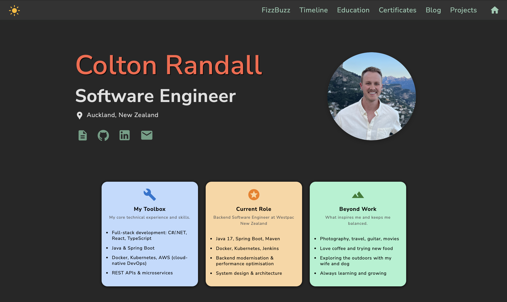
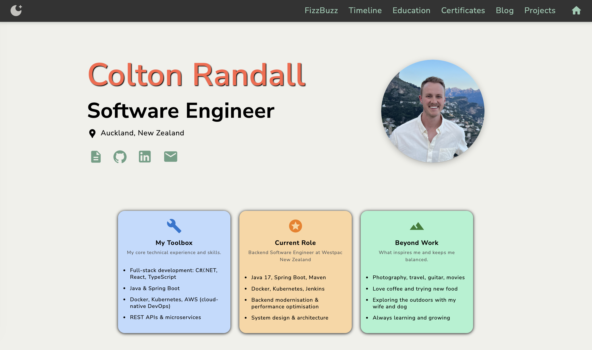

# Colton's Developer Portfolio

🔗 View the live site → [coltonrandall.com](https://coltonrandall.com)

Personal developer portfolio built with React and Material UI. A space to showcase my professional background, career timeline, and the projects I've built.

This site also serves as my development sandbox — a place to consolidate modern web knowledge and experiment with new tools, techniques, and UI patterns.

<br/>

### UI

Dark mode



Light mode



Mobile
<br/>


<br/>

### Features

- Dark / light mode toggle
- Typewriter animation cycling through role titles
- Project gallery with filterable tech stack chips
- Career timeline
- Blog with markdown-rendered posts
- Responsive design — mobile & tablet friendly
- Automated CI/CD via GitHub Actions

<br/>

### ⚙️ Tech Stack

- **Framework:** React + Vite
- **Routing:** React Router
- **UI Library:** Material UI (MUI)
- **Deployment:** GitHub Pages via GitHub Actions
- **Infrastructure:** Terraform for AWS S3 static hosting (experimental)

<br/>

### 🚀 Getting Started

```sh
# Install dependencies
npm install

# Run dev server
npm run dev

# Build for production
npm run build

# Deploy to GitHub Pages
npm run deploy
```

For AWS deployment via Terraform:

```sh
cd infra
terraform apply
```

> Or use `npm run deploy:all` to deploy to both GitHub Pages and AWS in one step.

<br/>

### 🌐 AWS Integration

Includes a Terraform setup for deploying to AWS S3 with static website hosting. The intention is to fully migrate to AWS with Route 53 for domain management and CloudFront for CDN and HTTPS support.

<br/>

This is a complete overhaul of my original static HTML/CSS/JS site — [old-portfolio-website](https://github.com/ColtonRandall/old-portfolio-website).
