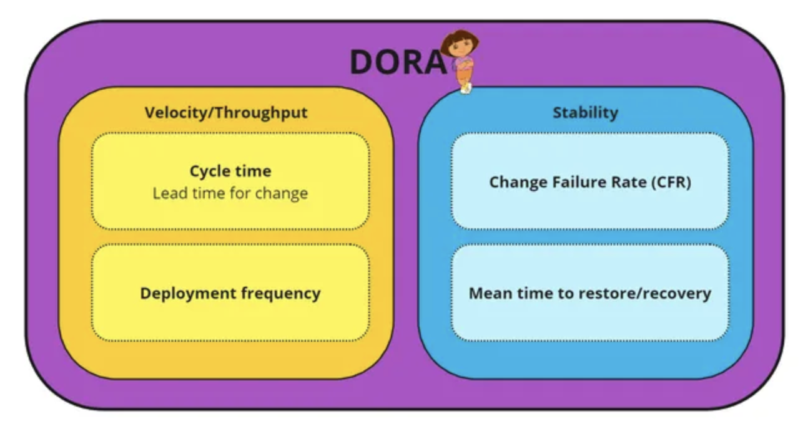
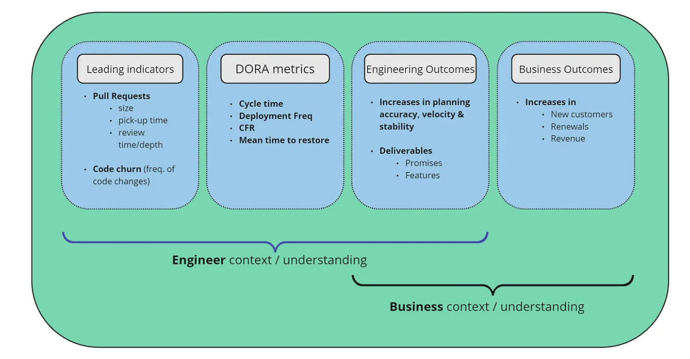

#### July 11, 2024

# DORA metrics: What are they and how do they promote Engineering excellence?

For me at least, I feel like the phrase “DORA metrics” has been thrown around a fair bit recently in the software scene, and while I know what it stands for, I still struggled to understand and articulate the nuances in how they drive and measure engineering performance, efficiency and ultimately, business outcomes.

This article aims to aid my (and anyone else’s) understandings of DORA, by summarising what they are, and how they’re implemented for success, to benefit the overall customer experience of the product/features, the business itself and the engineers who work on the products and codebase.

### The current state of DevOps measurement

The overarching expectation of Engineers is delivery, specifically, delivering great customer experiences, promises, and doing it as fast as possible. If done right, by finding the delicate balance of speed and quality, the benefits will be evident across customers, engineers and the performance of the business - everyone wins.

The potential problem with agile practices is that we track continuous improvement and deployment frequency retrospectively, after code has already been released.
Story pointing is helpful, but can only take us so far, and is not 100% accurate in measuring the team’s actual velocity and overall performance.

For example, have you ever heard the following scenario?

> _That story took 3 points this week, which was longer than we expected. So, the next similar user story should be 5 points._

The current question is, does this actually help Engineering teams do a better job in the long run?

### DORA — What are they?

DevOps Research and Assessment - The measurement of software development performance, which help teams determine where they rank compared to the industry, and can help foster more efficient goal-setting to maximise their capabilities in the long-term.

DORA focuses on four key metrics, split across two categories that define these rankings.

Velocity (also referred to as Throughput)

- Lead time for changes (Cycle time) — How long it takes from commit to production code.
- Deployment frequency — How often do you release a change to end users.

Stability

- Change failure rate (CFR) — the percentage of deployments that caused an incident, or that required remediation. CFR (%) = # of change failures/total # deployments.
- Mean time to recovery — a team’s ability to recover/bounce back from an incident or system failure.

It’s important to note that velocity does not equal feature delivery, but better thought of as the rate of change.

### Using DORA to boost Engineering efficiency

The above key metrics have a desired ‘industry standard’ range for the efficiency of teams. Teams with greater efficiency regarding DORA will fall into a different performance ranges compared to teams that need more focus.

For example:

`Elite teams`

- Velocity may allow for a cycle/lead time of less than 24–48 hours and have a deployment frequency of multiple times per day.
- Their stability might be around the 0–15% range, with the ability to restore services within an hour.

`Teams that need more focus`

- Velocity could have a cycle time of up to 210+ hours and have a deployment frequency of less then once per week.
- A lower stability might be around the 0–15% range, with the ability to restore services within an hour.

| DORA Metric          | Elite                  | High                | Medium                         | Low                                        |
| -------------------- | ---------------------- | ------------------- | ------------------------------ | ------------------------------------------ |
| Deployment Freq      | Multiple times per day | Once per day - week | Once per week - once per month | Between 1 per month or once every 6 months |
| Cycle / Lead time    | < 1 day                | 1 day - 1 week      | 1 week - 1 month               | 1 - 6 months                               |
| Mean time to restore | < 1 hour               | < 1 day             | 1 day - 1 week                 | 1 week - 1 month or longer                 |
| CFR                  | 0 - 15%                | ~ 16 - 30%          | ~ 16 - 30%                     | ~ 45 - 60%                                 |

The industry standard for measuring team’s DORA efficiency

### Ok well… Where should my team start?

A good place to start would be the above table. Teams are encouraged to assess which DORA metric column they’re likely to fall in, by benchmarking themselves against the metrics of what the industry considers to be both efficient and inefficient.

However, in his talk ‘[DORA Metrics: We’ve Been Using Them Wrong](https://www.youtube.com/watch?v=H3nlvHQHb5E&ab_channel=LinearB)~’ Zach Westall emphasises how teams put too much focus on DORA when wanting to improve their overall efficiency, which obscures the bigger picture of maximising engineering performance.
He illustrated where DORA fits into the ‘engineering improvement’ pipeline and how they influence engineering and business performance. I’ve re-visualised the diagram below:

#### The Domino Effect

The important point from this talk is what comes before DORA — the Leading Indicators.
You can’t just magically improve DORA metrics, teams need to start at the foundational level of engineering excellence — your pull requests.

When these are impacted, DORA metrics will suffer, which will flow onto reducing the overall output of Engineering and Business outcomes, so this is a really good starting point to investing in implementing DORA for teams that aren’t reaching their full potential.

#### Improving Leading Indicators — The importance of good PR etiquette

Pull requests are said to be the best indicator of development pipeline health, and impact DORA the most.
Research on PRs have shown the following:

- They’re mostly idle — sitting there doing nothing, not being deployed and wasting time and efficiency.
- PRs that take less than 15min to review get picked up 20x faster.
- PRs less than 200 diff size get merged 2x as fast.
- Smaller PRs = faster cycle time = more deployments = higher stability = more features 🚀
- Smaller PRs = less churn = fewer incidents (Change failure rate — CFR) = faster restoration (Mean time to restore) = higher stability = more features 🚀

More detail on PR best practices can be found ~[here](https://blog.codacy.com/pull-request-best-practices).

#### Next steps

After determining where your team ranks on the industry standard table, and addressing the leading indicators, it’s then important to have a goal-setting discussion with the team around specific DORA metrics you’re wanting to improve.
Some resources also suggest automating certain workflows (i.e. in Slack) — this could include creating a bot to update the team on outstanding PRs that have been in review for a while, or anything else that will directly influence one of the four key metrics.

### Considerations when using DORA metrics

From what I’ve seen, DORA isn’t the magical be-all-end-all method to increasing performance, and many resources cite it having it’s own set of pitfalls that are important to highlight, too.

#### The importance of context — Car analogy 🚗

DORA without context is next to useless. During[this video](https://www.youtube.com/watch?v=hbeyCECbLhk&ab_channel=ContinuousDelivery), Dave Farley compares using DORA to the instruments in a car. They practically make no sense without the context and correlation with other instruments.

For example, if the speedometer says the car is travelling at 50km/hr, is this good or bad? It entirely depends on the context — it’s good if we’re within the speed limit and the car is still performing as it should while allowing us to get to the destination in good time before the deadline.

However, it’s bad if we’re in a low speed zone or want to maximise our range. Similarly, overheating our engine by continually driving too fast for too long will lead to an engine failure, and we won’t arrive to our destination at all.

It’s important therefore to view DORA metrics for what they are — useful gauges, not targets.

### Challenges

Setting long-term and ambitious goals based on DORA metrics may be daunting to some teams, but it’s also important to set short-term, incremental goals that will build into that larger milestone down the road — a good book to read on this is [Atomic Habits](https://jamesclear.com/atomic-habits).
Metrics as a goal could lead to some teams trying to ‘cheat the system’ if they see data collection and the time investment in setting up measures for efficiency as overwhelming.
