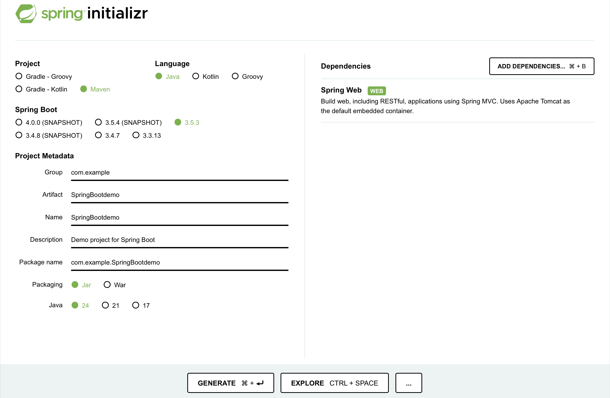

#### June 22, 2025

# How Spring Boot can Accelerate Java Development

Java has become one of the world’s most prolific object-oriented programming languages since James Gosling created it in 1995.

It is particularly common in [enterprise companies](https://www.antino.com/blog/java-development-for-enterprise-software) such as banks, insurance, healthcare, telco etc., due to its security (via [bytecode verification](https://www.oracle.com/java/technologies/security-in-java.html) within the JVM), reliability, scalability and immense versatility across environments and platforms, garnering it’s reputation as a ‘Write one, run anywhere’ language.

During Java’s lifespan, and while dominating the technical arena of these industries, a huge number of libraries and frameworks have been created to support and enhance the development of Java applications. The most popular of which, is the Spring Framework.

Spring is used to speed up the development of ‘modern Java-based enterprise applications’, as highlighted in the [documentation](https://spring.io/projects/spring-framework). Spring has a huge support system, integrations, tooling, testing libraries, web frameworks and more, which makes it highly desirable among Java devs.

Spring Boot, is a tool based on the Spring framework, that ultimately speeds up the development process of Java applications, with the ability to choose defaults for configurations, reduce setup time, and is fantastic for building and deploying modern web apps, microservices and APIs. It is the framework / tool of choice by certain large-scale Tech companies such as Netflix, Uber and LinkedIn.
One way of looking at the [differences between the two](https://www.techtarget.com/searchapparchitecture/video/Difference-between-the-Spring-Framework-and-Spring-Boot), is that Spring gives you all the necessary ingredients to build something with the parameters and configurations you want (i.e. which server, components, beans, etc.), whereas Spring Boot comes with an ‘out-of-the-box’, setup (a.k.a. a ‘project initialiser’), so you can get a web app or API off the ground with minimal effort. [^5]

## What problem does Spring Boot solve?

Java is a broad, and deep programming language, and with that comes a fair amount of boilerplate code, project configuration and dependency management that ultimately increases development overhead.
Enter Spring Boot, which, as I mentioned above, has fully integrated, pre-packaged configurations that significantly reduces the time needed to set up complex Java apps. A few examples of the advantages of Spring Boot are: [^6]

- Embedded servers (Tomcat / Jetty) - Simplifies production deployment.
- Built-in health checks, metrics, logging and testing features.
- Microservices Support.
- Auto-configuration properties - i.e. using Spring Data JPA for database management. It gives you access to a preset of data queries that significantly reduces boilerplate code.

## A simple REST API before and after using Spring Boot:

**Before (Java and Servlet):**

```java
public class HelloServlet extends HttpServlet {
    protected void doGet(HttpServletRequest req, HttpServletResponse resp)
    throws IOException {
        resp.setContentType("text/plain");
        resp.getWriter().write("Hello, Medium reader!");
    }
}
```

- Note - for the above example, you also need to configure the xml and external server to get the API working.

---

**After (using Spring Boot):**

```java
@RestController
public class HelloController {
    @GetMapping("/helloReader")
    public String hello() {
        return "Hello, Medium reader!";
    }
}
```

- This is all you need! Run the above within a Spring Boot application and you have a working API endpoint.

## What are Beans in Spring?

When using Spring / Spring Boot, you will come across the term ‘bean’. Essentially, all it is, is a [Java object](https://docs.spring.io/spring-framework/reference/core/beans/introduction.html). It’s referred to as a ‘bean’ because they’re based on the fact it’s a small, reusable component (i.e. a class) that can grow, or be combined with others to create something bigger than itself, similar to lego.
The Java branding has also always been revolved around coffee, so the analogy of a java ‘bean’ being a component of a cup of coffee (the application), is another way of looking at it.
Spring Boot manages these beans for you, which reduces the need for you to get bogged down in object creation, dependency injection, or having ti think about when to create and destroy it (lifecycle management). Essentially, the use of beans in Java further reduces the boilerplate code you need to write in your application.

### How to create a bean

Spring will automatically create beans when certain [annotations](https://www.geeksforgeeks.org/spring-framework-annotations/) are appended to the top of a method or class.

For example - if you annotate a class with either `@Component` , `@Service` or `@Respository`:

```java
@Component
public class MyService {
    public String sayHello() {
        return "Hello!";
    }
}
```

You can then use it in another class, and Spring will recognise the `ExampleService` as a bean and auto-inject it into the controller `ExampleController`:

```java
@RestController
public class MyController {

    private final MyService myService;

    public MyController(MyService injectedService) {
        this.myService = injectedService;
    }

    @GetMapping("/")
    public String hello() {
        return myService.sayHello();
    }
}
```

## The limitations of Spring Boot

With all the benefits of using Spring Boot, there will naturally be some [trade-offs](https://bambooagile.eu/insights/pros-and-cons-of-using-spring-boot) that are worth mentioning, the main ones being:

- Memory consumption - Due to the huge amount of auto configuration built into it, comes a level of memory consumption it takes. Because of this, it may feel slightly heavy for simple apps (i.e. a basic API).
- Latency when starting up a project - extensive bean configurations lead to higher initialisation times, which delays startup. Also, large and complex configuration files that are built into Spring Boot.
- Sometimes it can be opinionated and make decisions for you due to all the built-in functionality and configurations.

## Should you use Spring Boot?

It’s ultimately up to the engineer to decide whether the above downsides are deal breakers for their particular application. Largely, however, the benefits seem to outweigh the cons of using Spring Boot, with its built-in auto configuration and dependency injection, modular and scalable architectural design, massive ecosystem for [additions to your application](https://spring.io/projects/spring-boot) (i.e. databases, REST APIs, monitoring, logging, testing and more), a vibrant community and support system online, with a wealth of tutorials and documentation, and finally, being able to hard-proven, production-grade tool used by companies everywhere.

## How to get started with Spring Boot

Visit the [Spring Initializr](https://start.spring.io/) website to generate yourself a starter Spring Boot project. Generally, for most simple projects you can leave the defaults as they are, and the dependencies you will want will depend on your use cases.

- Web app / API - `Spring Web`
- Database - `Spring Data JPA`
- Security - `Spring Security`

For now, you can just select `Spring Web`, then click the ‘Generate’ button to download the .zip file.



You can now unzip this file, open it in an IDE (i.e. IntelliJ or VSCode), and wait for Maven to configure your dependencies - You’re now good to go!

Run the app in main class - it will be annotated with `@SpringBootApplication`, or you can find it in this path:

```java
src/main/java/com/example/demo/DemoApplication.java
```

Once that runs, navigate to [http://localhost:8080](http://localhost:8080) to see your Spring Boot app running.

## Resources

1. [Reasons Why Enterprise Software Development with Java is the best choice](https://www.antino.com/blog/java-development-for-enterprise-software)

2. [Write once, run anywhere](https://en.wikipedia.org/wiki/Write_once,_run_anywhere)

3. [The Java Language Environment](https://www.oracle.com/java/technologies/security-in-java.html)

4. [Spring Framework](https://spring.io/projects/spring-framework)

5. [Difference between the Spring Framework and Spring Boot](https://www.techtarget.com/searchapparchitecture/video/Difference-between-the-Spring-Framework-and-Spring-Boot)

6. [Introduction to Spring Boot: A Complete Guide](https://dev.to/krishna7852/introduction-to-spring-boot-a-complete-guide-203l)

7. [Introduction to the Spring IoC Container and Beans :: Spring Framework](https://docs.spring.io/spring-framework/reference/core/beans/introduction.html)

8. [Pros and Cons of Using Spring Boot](https://bambooagile.eu/insights/pros-and-cons-of-using-spring-boot)

9. [Spring Boot Performance Tuning: 5 Common Issues and How to Fix Them](https://www.cogentuniversity.com/post/spring-boot-performance-tuning-5-common-issues-and-how-to-fix-them)

10. [Spring Boot](https://spring.io/projects/spring-boot)
